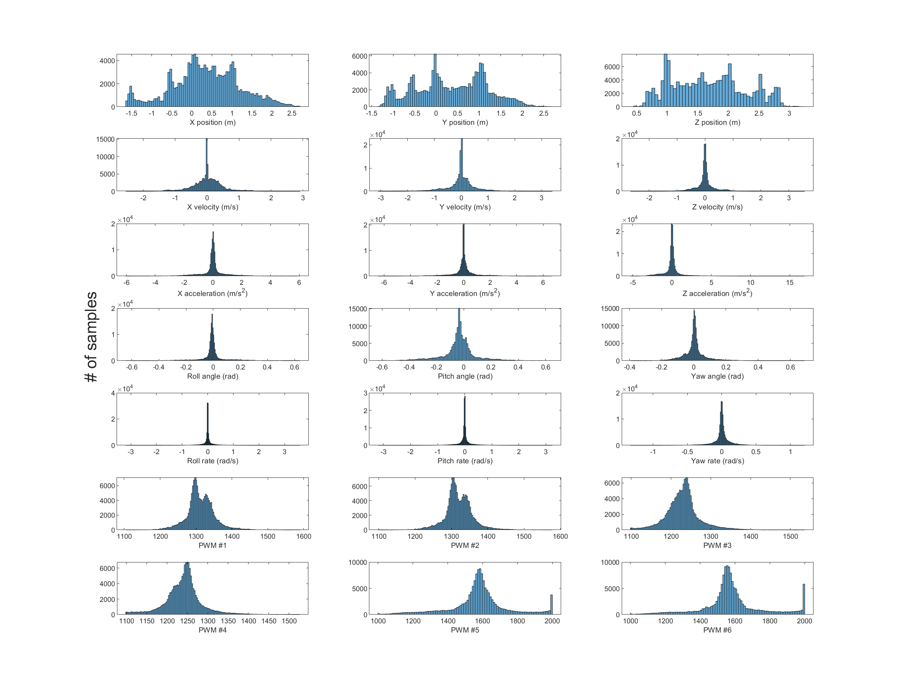

# Tail-sitter-dataset
## Introduction
This dataset is gathered for quadrotor tail-sitter UAV system identification and modeling by PolyU MAV/UAV Lab.
Format: MATLAB.mat file

## Hardware
The flight data is collected on a quadrotor tail-sitter UAV based on an Arkbird VTOL airframe. The UAV is equipped with a 3S LiPo 2200 mAh battery, 4 Sunnysky R2207 KV2580 motors with ESCs, and two servo motors for elevon control. The flight controller is a PixRacer autopilot board that communicates with an offboard computer via Wi-Fi module ESP8266. The offboard computer is a laptop with an Intel Core i7 that runs Ubuntu 18.04 OS. The vehicle position and orientation are measured at 200 Hz using a Vicon motion capture system with 12 cameras. The Vicon system is well calibrated before the data collection process. 

## Experiment Setup
The flight data is collected using both offboard and manual flight modes. In the offboard mode, the UAV tracks the local position references sent to MAVROS topic ~setpoint_position/local. The reference trajectory contains step changes in all three directions. Three step sizes 1, 1.5, and 2 meters were designed. In the manual mode, the UAV is operated by an expert pilot using Futaba T16SZ remote control. Three flight modes position, altitude, and stabilized are chosen to enrich the maneuvering intensity. Each experiment setup is performed three times to attenuate the influence of random error, resulting in 18 flight logs. The take-off and landing parts are chopped for better data quality and the total flight time is 24 minutes.

## Data Process
The UAV states are recorded to the onboard memory card, including position, velocity, acceleration, attitude, angular rate, controls input, and motor PWM. The recorded states, units and sources are listed in the following table.  
|State|Unit|Source|
| ---------------------- | ---------------------- |---------------------- |
|Local position|m|MAVROS topic ~local_position/pose|
|Local velocity|m/s|Time derivative of local position|
|Local acceleration|m/s^2|Time derivative of local velocity|
|Local attitude|rad|MAVROS topic ~local_position/pose|
|Local rate|rad/s|Time derivative of local attitude|
|Vision position|m|MAVROS topic ~vision_position/pose|
|Vision velocity|m/s|Time derivative of vision position|
|Vision acceleration|m/s^2|Time derivative of vision velocity|
|Vision attitude|rad|MAVROS topic ~vision_position/pose|
|Vision rate|rad/s|Time derivative of vision attitude|
|Actuator controls|N/A|MAVROS topic ~target_actuator_control|
|Actuator outputs|ms|MAVROS topic ~actuator_outputs|

Since states are recorded from various topics with different sampling rates, the raw data with ros timestamp is synchronized by interpolation at 100 Hz. All data are filtered using the "movmean" function in MATLAB to remove high frequency noise. Since velocity and acceleration are calculated by time derivative, the result is susceptible to high frequency noise.

## Distribution
The distribution of the processed data is listed below. Note that vision data is used in the figure.  
  
  
